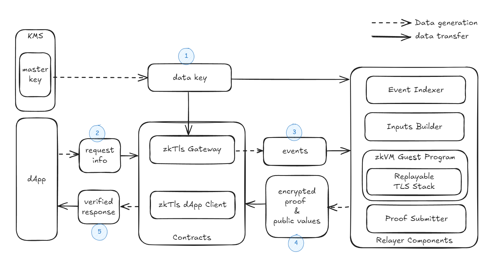

# zkTLS Overview

## What is zkTLS

TLS is a widely used foundational internet protocol that ensures the security and integrity of data transmission. Additionally, TLS uses PKI to enable entity authentication. By combining zero-knowledge (zk) with TLS, we construct the zkTLS protocol to prove the connection process of a TLS connection. The proof enables trustless access for Web3 to any endpoint that supports TLS connection.

## Architecture

The above diagram shows the data flow of the zkTLS system.

1. dApp sets up KMS master key and data key for data encryption.
2. dApp sends the KMS master key and request information to the zkTLS contract.
3. The `zkTLSGateway` emits a set of request events.
4. The relayer components will react on the events:
   - zkVM based circuit records and replays the TLS handshake process, and generate proofs
   - the submitter submits encrypted proofs and public inputs to the zkTLS contract for verification on blockchain.
5. After the verification passed, `zkTlsGateway` delivery the response to the dApp via its callback function.

