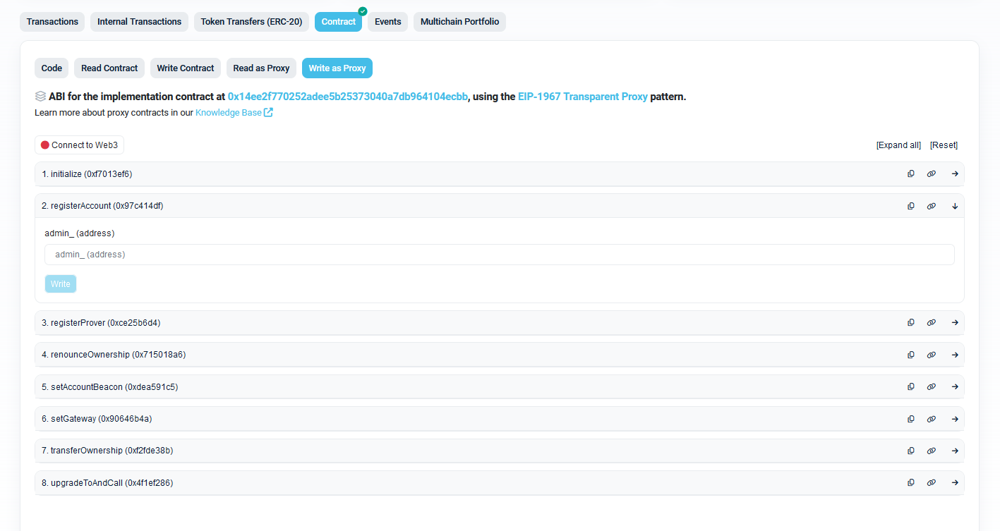
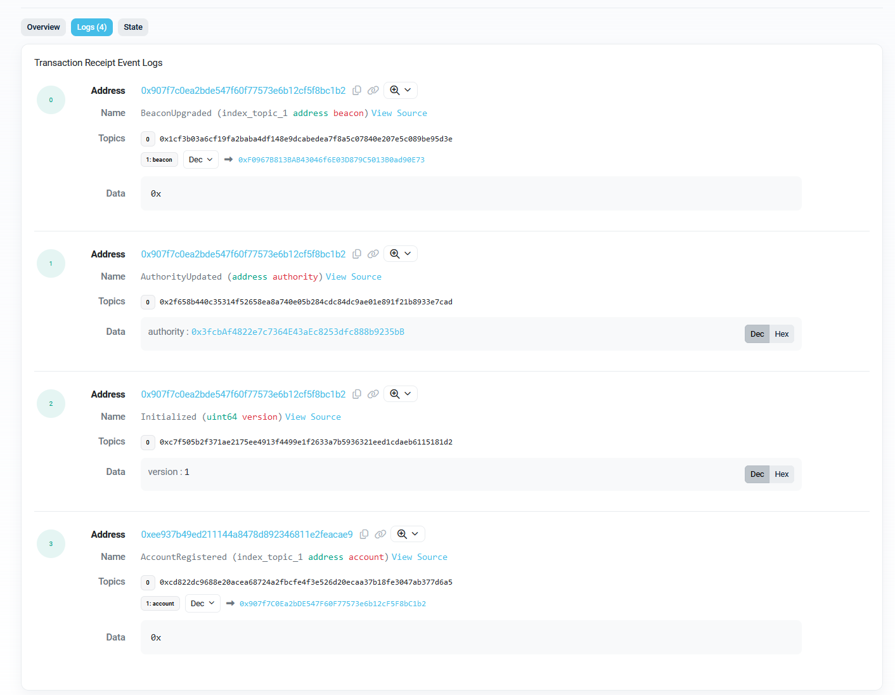

# Quick Start

## Set up dApp

* Create a new project for dApp

```bash
cd <your_dapp_dir>
forge init # create a new project 
forge soldeer init # enable soldeer for dependency management

# install zktls dependencies from release
forge soldeer install zktls~v0.1.0-alpha \
    https://github.com/the3cloud/zktls-contracts/archive/refs/tags/v0.1.0-alpha.zip
```

## Register zkTLS acount/client for dApp

* Go to zkTLSManager contract on explorer, for example [zkTLSManager on Linea Sepolia](https://sepolia.lineascan.build/address/0xeE937b49eD211144A8478d892346811E2feAcAE), and use the the `registerAccount(address admin_)` to register a new zkTLS client account.

  
  - Input parameter: an EOA address used for access control manager.

    

  - After transaction completed, find the created zkTLS client/account proxy address and access manager proxy address from transaction receipt.

    

## How to send request to zkTLS contracts and receive response

* Set up request and response templates as blob data.
* Send request to zkTLS contracts using `ZkTLSAccount.requestTLSCallTemplate`

    ```solidity
    // expectedGasPrice for native token, received from price oracle or other sources
    // requestTLSCallTemplate is the max additional amount of gas the dApp is willing to pay for callback delivery and verfication execution  

    function requestTLSCallTemplate(
            bytes32 proverId_,
            bytes calldata requestData_,
            bytes calldata responseTemplateData_,
            bytes calldata encryptedKey_,
            uint256 maxResponseBytes_,
            uint256 requestCallbackGasLimit_,
            uint256 expectedGasPrice_
    ) external payable returns (bytes32 requestId) {
    ```

* Implement `IZkTLSDAppCallback` interface to receive response. Reference to [ExampleDApp](https://github.com/the3cloud/zktls-contracts/blob/main/contracts/mock/ExampleDApp.sol)
    ```solidity
    interface IZkTLSDAppCallback {
        function deliveryResponse(
            bytes32 requestId_, 
            bytes calldata response_) external;
    }
    ```

---

More details can be found at [zkTLS contrascts docs](https://docs.the3.cloud/zktls-contracts/)
